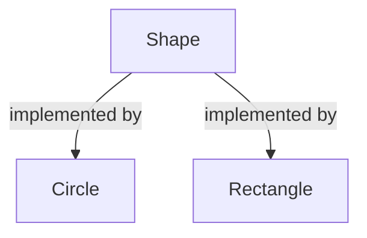

# 2022-10-04

static/dynamic types -> compile time
dynamic type -> run time

For custom destructors, you **MUST** make base class destructor virtual in order to properly call destructor on inherited class.

## Structure of OOP

Classes implement Interfaces



Interfaces usually have no functionality in and of itself and implements pure virtual members, like

```cpp
virtual int area() = 0;
```

This would be an example of an **abstract class**. It is good practice, in inherited classes, to use the keyword `override` to indicate that this function is meant to be overriden.

## Object Slicing

When an object is copied as its base class, ex as a parameter in a function, the object is sliced off from its functionality as an inherited class and instead just treated as the base class.


**Using private and protected is bad practice!!**