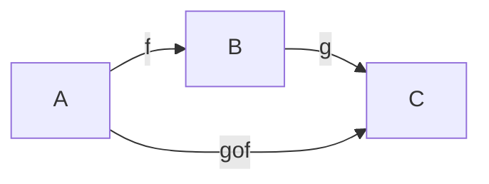
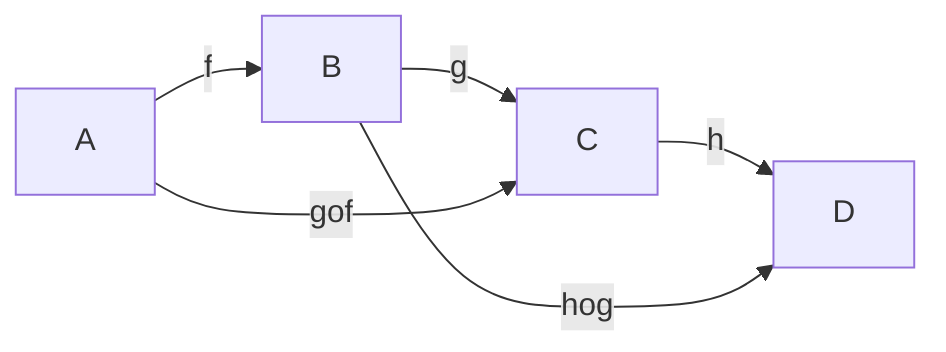
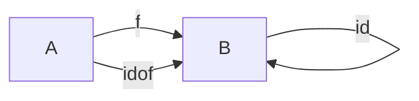
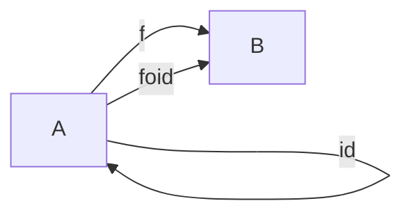

## Definition

A **function** is $b\in B$ which is an image of any given element $a \in A$
$$f(a)=b\: or \: b=f(a)$$

It is often thought in terms of its graph, that a function is its graph $\Gamma_{f}$.
$$\Gamma_{f} := \{(a,b) \in A \times B \: | \: b = f(a)\}\subseteq A \times B$$

But this leaves room for misinterpretation of one condition, which is:
$$(\forall a \in A)(\exists ! b \in B) (a,b) \in \Gamma_{f} \: or \: f(a)=b$$
Meaning that there must be only one output for every input.

You can notate a function as:
$$A \stackrel{f}{\longrightarrow} B, f: A \rightarrow B, a \leftrightarrow f(a)$$

$B^{A}:=$ the collection of all $f:A \rightarrow B$. Since f is defined as a graph of a certain mapping of $A$ onto $B$, it can be seen that

$$B^{A} \subseteq A \times B$$

## Functions for Set A

### Identity Function

$$id_{A}:A\rightarrow A$$
or
$$(\forall a \in A) id_{A}(a) = a$$

### Subsets

For a set $S$,

$$f(S) := {b \in B \: | \: (\exists a \in A) \: b = f(a)}$$

$\therefore f(S)$ is the subset $B$, or the range is $B$.

The largest subset $B$ can be is $f(A)$ which is also called the image of f or $im(f)$.

$$f|_{s}(s) = f(s)$$

This denotes that $f$ is restricted by $s$.

$$(\forall s \in S): f|_{s}, f:S \rightarrow B$$

Helper comparison:
$$f(A) = im(f), f(S) = im(f|_{s})$$

## Examples, Multisets, and Indexed Sets

**Multisets** can be explained in a function. $m(a)$ represents how many occurences of $a \in A$.

ex.
$$\{a,a,a,b,b,b,b,b,b,c,c\}=m:\{a,b,c\} \rightarrow \mathbb{N}^{+}$$
$$m(a)=3, m(b)=5, m(c)=2$$

**Indices** can also be explained as a function. $i \in I$ represents the index of a value $a \in A$.

$$\{a_{1},a_{2},...,a_{n}\}= a:{1,2,...,n}->\mathbb{Z}$$
$$I\rightarrow A$$

## Composition of Functions

If $f:A\rightarrow B$ and $g: B\rightarrow C$,
$$(\forall a \in A) (g \circ f)(a) := g(f(a)) $$
### Properties of Composite Functions

#### Commutative
$$g \circ f: A \rightarrow C$$

#### Associative
If $f:A \rightarrow B, g: B \rightarrow C, h: C \rightarrow D$,
$$h \circ(g \circ f) = (h \circ g) \circ f$$

### identity functions and composition

If $f:A \rightarrow B$
$$id_{B}\circ f = f$$

$$f \circ id_{A}=f$$

## Injections, Surjections, Bijections

### Injective
- One to one
- Different inputs have different outputs

### Surjective
- Onto
- Whole of $B$ is covered

### Bijective
- Both one to one and onto
#### Examples of Bijections
Identity Function, where
$$ id_{A}:A \rightarrow A$$
or $A'$ and $B'$ for disjoint unions, where
$$ f: A' = Ax\{0\}$$
$$(\forall a \in A)f(a) = (0,a)$$

## Injections, Surjections, Bijections 2nd View

If $f$ is a bijection and $f:A \rightarrow B, g: B \rightarrow A$.
$$f \circ g = id_{A} , g\circ f = id_B$$
- $f \circ g$ shows us that g is a right inverse of f.
- $g \circ f$ shows us that g is a left inverse of f.

**Bijections have inverses on both the right and left inverses.**

If $A \neq \{0\}$ and $f:A \rightarrow B$ is a function...
- $f$ has a left inverse $\iff$ it is injective
- $f$ has a right inverse $\iff$ it is surjective

### Another definition for inverses

If $T \subseteq B$
$$ f^{-1}(t) = \{a \in A\: | \: f(a) \in T \}$$
$T$ can also be defined as such, that $T={q}$ as a singleton of $q$, and thus
$$f^{-1}(T) = f^{-1}(q)$$
Is the fiber of f over q. 
Thus, $f:A->B$ is bijective if $f^{-1}(q)$ exists $\forall q  \in B$, or all fibers of $f$ over $q$ exist for all elements $B$, and elements $q$ are singletons.